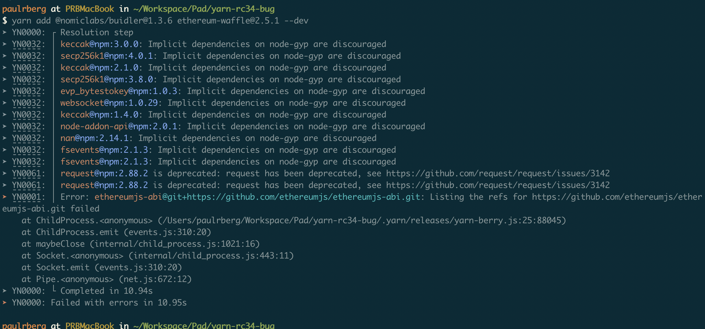

## @paulrberg/yarn-rc34-bug

Dummy project to reproduce the errors I encountered with yarn@2.0.0-rc.34.

### Steps to Reproduce

1. Clone this repository
2. Run `yarn install`

### Error



### Solution

This band-aid resolution seems to fix the error:

```sh
yarn set resolution ethereumjs-abi@git+https://github.com/ethereumjs/ethereumjs-abi.git 0.6.8
```

Yet I don't know how can I make this resolution persistent. The second time I run `yarn install`, the error comes back.
